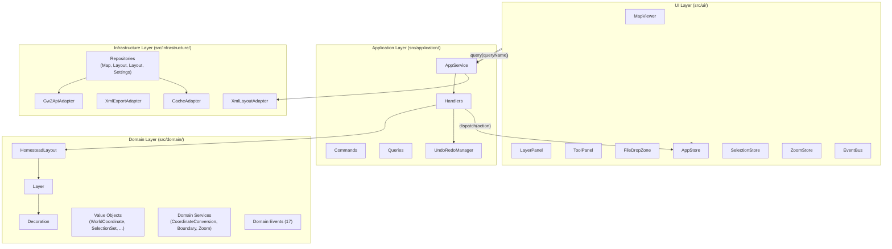

# GW2 Decoration Editor — Complete Architecture Analysis

## 1. Project Overview

**Name:** GW2 Decoration Editor  
**Purpose:** A browser-based tool for loading, editing, and exporting Guild Wars 2 homestead decoration layouts in XML format.

**Key Features:**
- Load homestead layouts from XML files
- Organize decorations into layers
- Create, move, and delete decorations
- Navigate maps with pan and zoom controls
- Undo/redo editing actions
- Export updated layouts back to XML
- Multi-map support with layer-based organization
- Dockable/resizable UI panels with layout persistence

### Tech Stack

| Concern | Technology |
|---|---|
| Language | TypeScript 5.x (ES2020+, ES Modules) |
| Runtime | Node.js ≥ 20.0.0 |
| Build | Vite + Terser minification |
| Unit/Integration Testing | Vitest (jsdom environment) |
| E2E Testing | Playwright |
| Coverage | v8 → HTML/LCOV |
| Runtime dependencies | **None** (browser app; DOM APIs only) |

**Configuration Files:**
- [tsconfig.json](../tsconfig.json) — Strict TypeScript, ES2025 target, DOM + DOM.Iterable libs
- [vite.config.ts](../vite.config.ts) — Base URL aware, Terser minification, sample XML discovery
- [vitest.config.ts](../vitest.config.ts) — jsdom environment, coverage reporting

---

## 2. Directory Structure

```
src/
├── domain/             # Pure domain logic — entities, value objects, domain services, events
├── application/        # CQRS orchestration — commands, queries, handlers, undo/redo
├── infrastructure/     # External concerns — GW2 API, XML I/O, localStorage, repositories
├── ui/                 # UI components, stores, EventBus, helpers
├── config/             # Global constants and coordinate system documentation
└── initialization/     # Application bootstrap

tests/
├── domain/             # Domain entity and value object unit tests
├── application/        # Handler and service unit tests
├── infrastructure/     # Repository and adapter tests
├── integration/        # Cross-layer integration tests
└── ui/                 # UI component tests

e2e/                    # Playwright end-to-end feature tests (24 spec files)
public/samples/         # Sample XML files for demo loading
docs/                   # Architecture and feature documentation
```

---

## 3. Domain Layer (`src/domain/`)

Pure business logic with **no dependencies** on infrastructure or UI. Implements Domain-Driven Design principles with entities, value objects, aggregates, domain services, and domain events.

### 3.1 Entities

#### [`Decoration.ts`](../src/domain/Decoration.ts) — Entity
Represents a single decoration item (GW2 prop-type).

| Property | Type | Notes |
|---|---|---|
| `id` | `string` | XML prop-type id — **exported to XML** |
| `uid` | `string` | Internal unique instance identifier (auto-counter) |
| `name` | `string` | Decoration display name |
| `position` | `WorldCoordinate` | 3D world position |
| `rotation` | `number` | Y-axis rotation (yaw) |
| `rotX` | `number` | X-axis rotation (pitch) |
| `rotZ` | `number` | Z-axis rotation (roll) |
| `scale` | `number` | Scale multiplier (must be positive) |

**Key Methods:**
```typescript
static create(propTypeId, name, position, rotation, scale): Decoration
validate(id, name, position, rotation, scale): void
toDTO(): Record<string, unknown>
clone(): Decoration
equals(other): boolean
```

#### [`Layer.ts`](../src/domain/Layer.ts) — Aggregate Entity
A named collection of decorations with visibility control.

| Property | Type | Notes |
|---|---|---|
| `id` | `string` | Layer identifier |
| `name` | `string` | Display name |
| `isVisible` | `boolean` | Visibility toggle |
| `color` | `string` | Hex color (#00d4ff default) |
| `decorations` | `Map<string, Decoration>` | Ordered by insertion |

**Key Methods:**
```typescript
addDecoration(decoration): void
removeDecoration(decorationId): void
insertDecorationAt(decoration, index): void
getDecoration(decorationId): Decoration | null
getDecorationIndex(decorationId): number
getAllDecorations(): Decoration[]
```

**Invariants:** Cannot add duplicate decoration `uid`s; layer name must be non-empty.

#### [`GW2Map.ts`](../src/domain/GW2Map.ts) — Aggregate Root
Represents a Guild Wars 2 map instance fetched from the GW2 API.

| Property | Type |
|---|---|
| `id` | `number` |
| `name` | `string` |
| `continent_id` | `number` |
| `floor` | `number` |
| `tiles` | `unknown[]` |
| `boundary` | `MapBoundary \| null` |
| `rect` | `{ min, max, width, height } \| null` |

#### [`HomesteadLayout.ts`](../src/domain/HomesteadLayout.ts) — Root Aggregate
The top-level aggregate root. Owns all layers and enforces cross-layer invariants.

| Property | Type | Notes |
|---|---|---|
| `id` | `string` | Layout identifier |
| `name` | `string` | Layout name |
| `map` | `GW2Map \| null` | Active map |
| `layers` | `Map<string, Layer>` | All layers |
| `activeLayerId` | `string \| null` | Currently selected layer |
| `pendingEvents` | `DomainEvent[]` | Unpublished domain events |

**Key Methods:**
```typescript
addLayer(layer): void
removeLayer(layerId): void
getLayer(layerId): Layer | null
getAllLayers(): Layer[]
getDecorationLayer(decorationId): Layer | null
moveDecorations(decorationIds, targetLayerId): { moved: Map, skipped: string[] }
addEvent(event): void
```

**Invariants:** First added layer becomes active; active layer auto-switches on deletion.

---

### 3.2 Value Objects

All value objects are **immutable** and compared by value, not reference.

| Class | File | Description |
|---|---|---|
| `WorldCoordinate` | [`WorldCoordinate.ts`](../src/domain/WorldCoordinate.ts) | 3D GW2 world position + rotation |
| `MapCoordinate` | [`MapCoordinate.ts`](../src/domain/MapCoordinate.ts) | 2D local map space position |
| `ContinentCoordinate` | [`ContinentCoordinate.ts`](../src/domain/ContinentCoordinate.ts) | Position in continent tile system |
| `ScreenCoordinate` | [`ScreenCoordinate.ts`](../src/domain/ScreenCoordinate.ts) | 2D SVG viewport position |
| `Coordinate` | [`Coordinate.ts`](../src/domain/Coordinate.ts) | Generic 2D coordinate with array/object conversion |
| `SelectionSet` | [`SelectionSet.ts`](../src/domain/SelectionSet.ts) | Immutable set of selected decoration IDs |
| `LayerId` | [`LayerId.ts`](../src/domain/LayerId.ts) | Validated layer identifier (max 256 chars) |

All value objects implement `equals(other)`, `clone()`, `distanceTo(other)`.

`SelectionSet` returns new instances on mutation (functional style):
```typescript
const next = selectionSet.add(id)        // returns new SelectionSet
const toggled = selectionSet.toggle(id)  // returns new SelectionSet
```

---

### 3.3 Domain Services

Stateless logic that doesn't naturally belong to a single entity.

#### [`CoordinateConversionService.ts`](../src/domain/CoordinateConversionService.ts)
Converts between all four coordinate systems:
```typescript
static continentToMap(continentCoord, mapFloorData): MapCoordinate
static mapToScreen(mapCoord, zoomState, scale): ScreenCoordinate
static screenToMap(screenCoord, zoomState, scale): MapCoordinate
static continentToScreen(continentCoord, mapFloorData, zoomState, scale): ScreenCoordinate
```
Uses the GW2 API affine transform (continent_rect ↔ map_rect) for continent↔map conversions, and applies zoom/pan for map↔screen.

#### [`BoundaryCalculationService.ts`](../src/domain/BoundaryCalculationService.ts)
```typescript
static calculateDecorationBoundary(decoration): MapRect
static calculateLayerBoundary(layer): MapBoundary
static calculateLayoutBoundary(layout): MapBoundary
static isPointInBoundary(point, boundary): boolean
static getDecorationRadius(decoration): number
```

#### [`ZoomCalculationService.ts`](../src/domain/ZoomCalculationService.ts)
```typescript
static calculateZoomToFit(mapBoundary, viewportDimensions): { xZoom, yZoom, centerX, centerY }
```

#### [`LayoutValidationService.ts`](../src/domain/LayoutValidationService.ts)
```typescript
static validateLayout(layout): { isValid, errors[] }
static validateLayer(layer): { isValid, errors[] }
static validateDecoration(decoration): { isValid, errors[] }
```

---

### 3.4 Domain Events (`src/domain/events/`)

Base class: [`DomainEvent.ts`](../src/domain/events/DomainEvent.ts)

```typescript
class DomainEvent {
  aggregateId: string
  eventType: string
  timestamp: Date
  version: number
}
```

**17 Domain Events:**

| Category | Events |
|---|---|
| Decoration | `DecorationAddedEvent`, `DecorationDeletedEvent`, `DecorationsDeletedEvent`, `DecorationsMovedEvent`, `DecorationUpdatedEvent` |
| Layer | `LayerCreatedEvent`, `LayerDeletedEvent`, `LayerRenamedEvent`, `LayerVisibilityToggledEvent`, `LayerColorChangedEvent`, `LayerSelectedEvent`, `AllLayersClearedEvent` |
| Layout | `LayoutLoadedEvent`, `MapSwitchedEvent` |
| UI | `ZoomChangedEvent`, `PanChangedEvent` |

Events are stored in `layout.pendingEvents` and can be published via the EventBus.

---

## 4. Application Layer (`src/application/`)

Orchestrates domain logic without containing business rules. Implements **CQRS** (Command Query Responsibility Segregation).

### 4.1 [`AppService.ts`](../src/application/AppService.ts)

Central command/query dispatcher and handler registry.

```typescript
class AppService {
  static async createAsync(layout, xmlAdapter): Promise<AppService>
  setAppStore(store): void
  execute(commandName, data): any
  query(queryName, data): any
  registerCommandHandler(name, handler): void
  registerQueryHandler(name, handler): void
  subscribe(eventType, handler): void
  publish(eventType, data): void
}
```

`createAsync()` dynamically loads and registers all 30+ handlers.

---

### 4.2 Commands (`src/application/commands/`) — 24 total

Commands express **intent** to modify state.

| Category | Commands |
|---|---|
| Layer | `CreateLayerCommand`, `DeleteLayerCommand`, `RenameLayerCommand`, `SetActiveLayerCommand`, `ToggleLayerVisibilityCommand`, `SetLayerColorCommand` |
| Decoration | `AddDecorationCommand`, `DeleteDecorationCommand`, `UpdateDecorationCommand`, `MoveDecorationsCommand`, `DeleteDecorationsCommand` |
| Layout | `LoadLayoutCommand`, `LoadAdditionalLayoutCommand`, `SwitchMapCommand` |
| Camera | `SetZoomCommand`, `SetPanCommand` |
| Export | `ExportLayersCommand` |
| Layout | `DockPanelCommand`, `MergePanelToTabCommand`, `StackPanelCommand`, `ReorderPanelCommand`, `ResizeDockCommand`, `ResetLayoutCommand` |

---

### 4.3 Queries (`src/application/queries/`) — 3 total

Queries are **read-only** and never modify state.

```typescript
class GetLayersQuery { layout }     // → all layers
class GetMapQuery { layout }        // → current map
class GetLayoutQuery { layoutId } // → layout by id
```

---

### 4.4 Handlers (`src/application/handlers/`)

Each handler:
1. Validates the command
2. Operates on the domain (via the aggregate)
3. Pushes an `UndoRecord` (if undo/redo is applicable)
4. Emits a domain event
5. Returns a result

**Example — `CreateLayerHandler`:**
```typescript
execute(command): Layer {
  // 1. Validate command
  // 2. Generate unique layer ID/name
  // 3. Auto-assign unused color from palette
  // 4. Create Layer entity
  // 5. Add to HomesteadLayout aggregate
  // 6. Push UndoRecord
  // 7. Emit LayerCreatedEvent
  // 8. Return created layer
}
```

---

### 4.5 Undo/Redo

#### [`UndoRedoManager.ts`](../src/application/UndoRedoManager.ts) — Dual-Stack Pattern

```
undoStack: [record1, record2, record3]  ← most recent at end
redoStack: [record4]

undo() → pop from undoStack, push to redoStack
redo() → pop from redoStack, push to undoStack
push() → clears redoStack
```

```typescript
constructor(maxSize = 50)
push(undoRecord): void
undo(): UndoRecord | null
redo(): UndoRecord | null
canUndo(): boolean
canRedo(): boolean
getUndoLabel(): string | null
getRedoLabel(): string | null
subscribe(listener): void   // { canUndo, canRedo, undoLabel, redoLabel }
```

#### [`UndoRecord.ts`](../src/application/UndoRecord.ts)

```typescript
class UndoRecord {
  id: string
  label: string                               // "Move 3 decorations to Layer B"
  commandType: string                         // "MoveDecorationsCommand"
  forwardData: Record<string, unknown>        // Data to redo
  reverseData: Record<string, unknown>        // Data to undo
  timestamp: Date
}
```

---

### 4.6 DTOs (`src/application/dtos/`)

| DTO | Properties |
|---|---|
| `DecorationDTO` | `id`, `uid`, `name`, `position`, `rotation`, `rotX`, `rotZ`, `scale` |
| `LayerDTO` | `id`, `name`, `isVisible`, `color`, `decorationCount` |
| `MapDTO` | `id`, `name`, `continent_id`, `floor` |
| `LayoutDTO` | `id`, `name`, `map`, `layers[]`, `decorationCount` |

---

## 5. Infrastructure Layer (`src/infrastructure/`)

Handles all external concerns: GW2 API, XML parsing/export, localStorage persistence.

### 5.1 [`InfrastructureFactory.ts`](../src/infrastructure/InfrastructureFactory.ts)

Dependency injection container. Creates and holds singleton instances of all infrastructure components.

```typescript
getApiAdapter(): Gw2ApiAdapter
getCacheAdapter(): LocalStorageCacheAdapter
getLayoutAdapter(): XmlLayoutAdapter
getMapRepository(): Gw2MapRepository
```

Default configuration:
```typescript
{
  apiBaseUrl: 'https://api.guildwars2.com',
  apiMaxRetries: 3,
  apiTimeout: 10000,
  cacheDefaultTTL: 3600,       // 1 hour
  cacheStoragePrefix: 'gw2-cache',
  layoutStorageKey: 'gw2-layouts'
}
```

---

### 5.2 Adapters (`src/infrastructure/adapters/`)

#### [`Gw2ApiAdapter.ts`](../src/infrastructure/adapters/Gw2ApiAdapter.ts)
Wraps GW2 REST API calls with retry logic and timeout handling.
```typescript
async getMap(mapId): Promise<MapData>
async getAllMapIds(): Promise<number[]>
async getFloor(continentId, floor): Promise<FloorData>
```

#### [`LocalStorageCacheAdapter.ts`](../src/infrastructure/adapters/LocalStorageCacheAdapter.ts)
Caches API responses in `localStorage` with TTL.
```typescript
async get(key): Promise<any>
async set(key, value, ttl): Promise<void>
async clear(key): Promise<void>
```

---

### 5.3 XML Adapters

#### [`XmlLayoutAdapter.ts`](../src/infrastructure/XmlLayoutAdapter.ts)
Parses and validates homestead XML layout files.
```typescript
static async parseLayout(xmlString): Promise<Layout>
static validateXmlString(xmlString): { isValid, errors[] }
static _validatePropElement(propElement, index): errors[]
static _extractLayout(xmlDoc): Layout
```

**Validation Rules:**
- Root element must have `mapId` and `mapName` attributes
- `mapId` must be a valid number
- Each `<prop>` must have: `id`, `name`, `pos` (x y z), `rot` (rx ry rz), `scl`
- `pos` and `rot` must be valid 3-component float tuples

#### [`XmlExportAdapter.ts`](../src/infrastructure/XmlExportAdapter.ts)
Serializes layers to GW2 homestead XML format.
```typescript
static serialize(map, layers): string
```

Uses `d.id` (the XML prop-type id), **not** `d.uid`, for export. Escapes `&`, `<`, `>`, `"`.

**Output format:**
```xml
<?xml version="1.0" encoding="UTF-8"?>
<Decorations version="1" mapId="123" mapName="Map Name" type="0">
    <prop id="419" name="Flower Pot" pos="100.0 200.0 50.0" rot="0.0 1.57 0.0" scl="1.0"/>
</Decorations>
```

---

### 5.4 Repositories (`src/infrastructure/repositories/`)

Abstract data access behind domain-defined interfaces.

| Repository | Abstract Interface | Implementation | Storage |
|---|---|---|---|
| Map | `MapRepository` | `Gw2MapRepository` | GW2 API + localStorage cache (two-layer) |
| Layout | `LayoutRepository` | `LocalLayoutRepository` | `localStorage` (JSON) |
| Layout | `LayoutRepository` | *(concrete)* | `localStorage` |
| Settings | `SettingsRepository` | *(concrete)* | `localStorage` |

`Gw2MapRepository` uses a two-layer cache: in-memory `Map<number, GW2Map>` first, then `localStorage`, then the GW2 API.

---

## 6. UI Layer (`src/ui/`)

Components, state stores, event system, and rendering utilities.

### 6.1 State Stores (`src/ui/stores/`)

#### [`AppStore.ts`](../src/ui/stores/AppStore.ts) — Central State (Singleton)

```typescript
// State shape
{
  layout: HomesteadLayout | null,
  layers: Layer[],
  activeLayerId: string | null,
  map: GW2Map | null,
  isDirty: boolean
}

// API
getState(): Object                    // Frozen copy
subscribe(listener): Function         // Returns unsubscribe
dispatch(action, payload): void
```

**Action types:** `LOAD_LAYOUT`, `CREATE_LAYER`, `DELETE_LAYER`, `RENAME_LAYER`, `SET_ACTIVE_LAYER`, `LOAD_ADDITIONAL_LAYOUT`, `MAP_SWITCHED`, `TOGGLE_LAYER_VISIBILITY`, `SET_LAYER_COLOR`, `UPDATE_LAYERS`, `DELETE_DECORATION`, `UPDATE_DECORATION`, `MOVE_DECORATIONS`, `DELETE_DECORATIONS`, `SET_ZOOM`, `SET_PAN`, `MARK_DIRTY`, `MARK_CLEAN`

#### [`SelectionStore.ts`](../src/ui/stores/SelectionStore.ts)
Manages decoration selection and active layer tracking.
```typescript
activeLayerId: string | null
selectedDecorationIds: Set<string>

setActiveLayer(layerId): void
addDecorationToSelection(decorationId): void
removeDecorationFromSelection(decorationId): void
clearSelection(): void
isDecorationSelected(decorationId): boolean
```

#### [`ZoomStore.ts`](../src/ui/stores/ZoomStore.ts)
```typescript
xZoom: number;  yZoom: number
xPan: number;   yPan: number

setZoom(xZoom, yZoom): void
setPan(xPan, yPan): void
onChange(callback): void
getState(): { xZoom, yZoom, xPan, yPan }
```

#### [`LayoutStore.ts`](../src/ui/stores/LayoutStore.ts)
Persists dock layout state.

#### [`ToolModeStore.ts`](../src/ui/stores/ToolModeStore.ts)
```typescript
currentMode: 'select' | 'move' | 'delete'
setMode(mode): void
```

---

### 6.2 [`EventBus.ts`](../src/ui/EventBus.ts) — Pub/Sub (Singleton)

```typescript
eventBus.subscribe('layer:created', handler)  // returns unsubscribe fn
eventBus.publish('layer:created', { layerId, layerName })
```

**Published Event Types:** `selection:changed`, `layer:activated`, `layer:created`, `layer:deleted`, `layout:loaded`, `decoration:updated`, `zoom:changed`

---

### 6.3 UI Components (`src/ui/components/`)

#### [`MapViewer.ts`](../src/ui/components/MapViewer.ts)
SVG-based map display with pan/zoom support.

**SVG group hierarchy:**
```
<g margin-transform>
  ├── <g tileGroup>      — map tile rectangles
  ├── <g boundaryGroup>  — map boundary polygon
  ├── <g layersGroup>    — per-layer groups
  └── <g decorationsGroup> — decoration circles
```

Subscribes to ZoomStore changes and applies CSS `transform` for zoom/pan. Selection rendered via thicker stroke on circles.

#### [`LayerPanel.ts`](../src/ui/components/LayerPanel.ts)
Layer list with visibility toggles, active-layer highlighting, create/delete buttons, and right-click context menu.

#### [`ToolPanel.ts`](../src/ui/components/ToolPanel.ts)
Tool mode buttons (Select/Move/Delete), zoom controls (in/out/fit), export and settings buttons.

#### [`FileDropZone.ts`](../src/ui/components/FileDropZone.ts)
Drag-drop overlay for XML layout loading. Validates XML before loading via AppService. Falls back to file input button.

#### Additional Components (22+ total)

| Component | Purpose |
|---|---|
| `DockManager.ts` | VSCode-style dockable panel layout |
| `DockRegion.ts` | Individual dock region |
| `TabbedContainer.ts` | Tabbed panel container |
| `StackedContainer.ts` | Stacked panel container |
| `PanelDragManager.ts` | Panel drag-drop handling |
| `SelectionRectangle.ts` | Rectangle selection on SVG canvas |
| `ExportDialog.ts` | XML export dialog |
| `ConfirmDialog.ts` | Generic confirmation dialog |
| `ContextMenu.ts` | Right-click context menu |
| `DecorationInfoDialog.ts` | Decoration detail view |
| `DecorationListPanel.ts` | Searchable decoration list |
| `DecorationReportDialog.ts` | Export statistics report |
| `SettingsDialog.ts` | User settings panel |
| `LayerColorDialog.ts` | Color picker for layers |

---

### 6.4 Utilities

| File | Purpose |
|---|---|
| [`domHelpers.ts`](../src/ui/domHelpers.ts) | `createElement`, `addClass`, `removeClass`, `toggleClass`, `queryElement` |
| [`renderHelpers.ts`](../src/ui/renderHelpers.ts) | SVG: `createSvgElement`, `createGroup`, `createCircle`, `createRect`, `createPolygon`, `createText` |
| [`eventBinders.ts`](../src/ui/eventBinders.ts) | `bindCreateLayerButton`, `bindDeleteLayerButton`, `bindFileDropZone` |
| [`ZoomHandler.ts`](../src/ui/ZoomHandler.ts) | Mouse-wheel zoom, mousedown/move/up pan, updates ZoomStore |
| [`ThemeManager.ts`](../src/ui/ThemeManager.ts) | Light/dark theme switching |

---

## 7. Configuration (`src/config/`)

### [`constants.ts`](../src/config/constants.ts)

```typescript
UI_LAYOUT = {
  MARGIN_TOP/RIGHT/BOTTOM/LEFT: 10,
  LAYER_PANEL_WIDTH: 300,
  TOOL_PANEL_WIDTH: 250,
  MIN_PANEL_WIDTH: 150,
  MAX_PANEL_WIDTH: 600,
  DECORATION_RADIUS: 10,
  DECORATION_RADIUS_SELECTED: 13,
}

ZOOM = {
  MIN_LEVEL: 1.0,    MAX_LEVEL: 30,
  DEFAULT_LEVEL: 1,  WHEEL_FACTOR: 1.2,
}

MAP = {
  TILE_SIZE: 256,
  CONTINENT_WIDTH: 32768, CONTINENT_HEIGHT: 32768,
}

LAYER_COLORS = ['#00d4ff', '#ff6b6b', '#51cf66', '#ffd43b', '#a78bfa', ...]
```

### [`coordinateSystems.ts`](../src/config/coordinateSystems.ts)
Documentation of the four coordinate systems and the transformation formulas between them.

---

## 8. Initialization (`src/initialization/`)

### [`ApplicationInitializer.ts`](../src/initialization/ApplicationInitializer.ts)

Bootstraps the entire application:

```
1. Create InfrastructureFactory
2. Get adapters and repositories
3. Create HomesteadLayout root aggregate
4. Get/create singleton stores (AppStore, ZoomStore, SelectionStore)
5. Create AppService (loads all 30+ handlers via createAsync)
6. Set AppStore reference on AppService
7. Create UndoRedoManager
8. Initialize UI components (DockManager, MapViewer, LayerPanel, ToolPanel, ...)
9. Return context object
```

**Returns:** `{ appService, infrastructure, appStore, zoomStore, selectionStore, eventBus, homesteadLayout, undoRedoManager, dockManager, ... }`

---

## 9. Entry Points

### [`index.html`](../index.html)
Minimal shell. Contains:
- `<div id="dock-manager-root">` — DockManager renders here
- Hidden content containers (`#chart-container`, `#layers-list`, `#tool-panel`) that are moved into dock regions at runtime

### [`script.ts`](../script.ts)

```typescript
async function setupRefactoredArchitecture() {
  appContext = await initializeApplication()
  appContext.appStore.subscribe((state) => { /* UI updates */ })
  // Initialize individual components...
}

document.addEventListener('DOMContentLoaded', setupRefactoredArchitecture)
```

---

## 10. Data Flow

### Example: User Moves a Decoration

```
1.  USER DRAG
    └─ MapViewer._handleDrop() called with decoration + target layer

2.  COMMAND CREATION (UI)
    └─ MoveDecorationsCommand { decorationIds: ['123'], targetLayerId: 'layer-2' }

3.  DISPATCH (UI → Application)
    └─ appService.execute('MoveDecorationsCommand', command)

4.  HANDLER (Application)
    └─ MoveDecorationsHandler.execute(command):
        a. Validate targetLayer exists
        b. Capture original layer/index for undo
        c. layout.moveDecorations(decorationIds, targetLayerId)   ← Domain
        d. Push UndoRecord to UndoRedoManager
        e. Emit DecorationsMovedEvent → layout.pendingEvents
        f. Return { success: true, moved: 1, skipped: 0 }

5.  STATE UPDATE (Application → UI)
    └─ AppStore.dispatch('MOVE_DECORATIONS', { decorationIds, fromLayerId, toLayerId })
    └─ AppStore notifies all subscribers

6.  RE-RENDER (UI)
    ├─ LayerPanel: update decoration counts
    └─ MapViewer: move SVG circles to new layer group

7.  UNDO AVAILABLE
    └─ UndoRedoManager._undoStack has 1 entry: "Move decoration to Layer B"
```

### Coordinate Transformation Chain

```
GW2 World Space
       │  (continent → map via GW2 API affine transform)
       ▼
  Map Space
       │  (map → screen via zoom, pan, and pixel scale)
       ▼
 Screen / SVG Space
```

```typescript
// Screen click → world position
const screenCoord = new ScreenCoordinate(500, 300)
const mapCoord = CoordinateConversionService.screenToMap(screenCoord, zoomState, scale)
// mapX = (screenX - xPan) / (scale.x * xZoom)

const worldCoord = CoordinateConversionService.mapToWorld(mapCoord, mapData)
```

---

## 11. Testing Strategy

### Structure

| Level | Directory | Framework | Count |
|---|---|---|---|
| Unit — Domain | `tests/domain/` | Vitest | ~26 files |
| Unit — Application | `tests/application/` | Vitest | ~30 files |
| Unit — Infrastructure | `tests/infrastructure/` | Vitest | — |
| Unit — UI | `tests/ui/` | Vitest | — |
| Integration | `tests/integration/` | Vitest | — |
| E2E | `e2e/` | Playwright | 24 spec files |

### Coverage Targets

| Layer | Coverage |
|---|---|
| Domain | ~95% |
| Application | ~90% |
| UI | ~70% |

### Test Patterns

**TDD — Red-Green-Refactor** is mandatory. Tests are written before implementation.

**Domain invariant test:**
```typescript
test('Layer cannot have duplicate decoration uids', () => {
  const layer = new Layer('1', 'Test')
  const dec = Decoration.create('419', 'Flower', coord)
  layer.addDecoration(dec)
  expect(() => layer.addDecoration(dec)).toThrow()
})
```

**Handler test:**
```typescript
test('CreateLayerHandler creates layer in layout', () => {
  const handler = new CreateLayerHandler(layout)
  const cmd = new CreateLayerCommand(layout, 'New Layer')
  const layer = handler.execute(cmd)
  expect(layout.getLayer(layer.id)).toBe(layer)
})
```

**E2E test files (Playwright):**

| Spec | Feature |
|---|---|
| `main-us2-switch-maps.spec.js` | Map switching |
| `main-us3-layer-visibility.spec.js` | Layer visibility toggles |
| `main-us4-delete-layer.spec.js` | Layer deletion |
| `main-us5-select-decorations.spec.js` | Decoration selection |
| `main-us6-move-decorations.spec.js` | Decoration movement |
| `main-us7-delete-decorations.spec.js` | Decoration deletion |
| `main-us8-undo-redo.spec.js` | Undo/redo |
| `main-us9-create-layer.spec.js` | Layer creation |
| `main-us10-tool-modes.spec.js` | Tool mode switching |
| `main-us11-zoom-fit.spec.js` | Zoom-to-fit |
| `main-us12-export-xml.spec.js` | XML export |

---

## 12. Key Design Patterns

### Domain-Driven Design (DDD)

- **Aggregates** — `HomesteadLayout` (root) → `Layer` (root) → `Decoration`
- **Value Objects** — `WorldCoordinate`, `SelectionSet`, etc.: immutable, compared by value
- **Domain Services** — Stateless cross-entity logic: `CoordinateConversionService`, `BoundaryCalculationService`
- **Domain Events** — 17 events stored in `layout.pendingEvents`
- **Repository Pattern** — Abstract data access defined in domain; implemented in infrastructure
- **No Anemic Domain Model** — Entities encapsulate behaviour, not just data

### CQRS

Commands (write) and Queries (read) are separate objects with separate handlers. All writes produce an `UndoRecord`.

### Pub/Sub (EventBus)

Cross-component communication without direct coupling. Components subscribe to typed events; changes are broadcast via `eventBus.publish()`.

### Undo/Redo Dual-Stack

```
push(record) → undoStack grows, redoStack clears
undo()       → pop undoStack, push redoStack
redo()       → pop redoStack, push undoStack
```

Max stack size: 50 entries (oldest dropped).

### Two-Layer Caching (Infrastructure)

GW2 API responses are cached in memory first (`Map<id, entity>`), then in `localStorage` with TTL, then fetched from the API. Read path checks each layer in order.

---

## 13. Architecture Diagram


