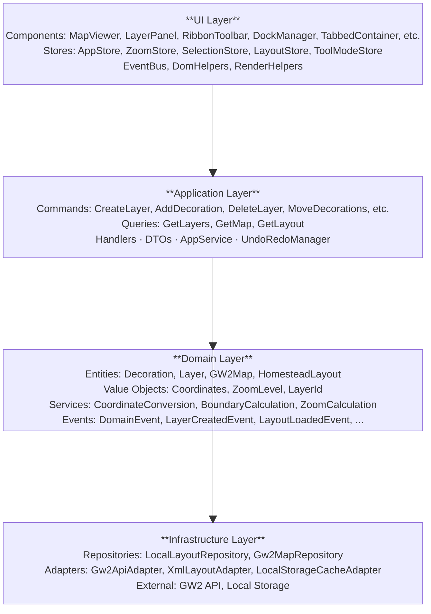
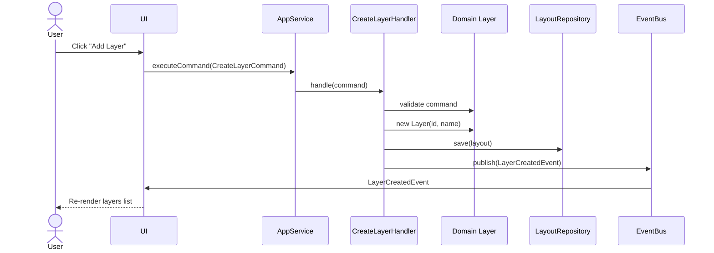
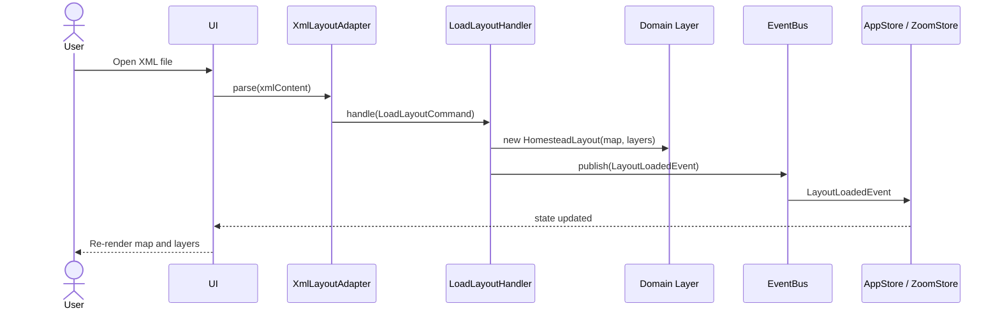
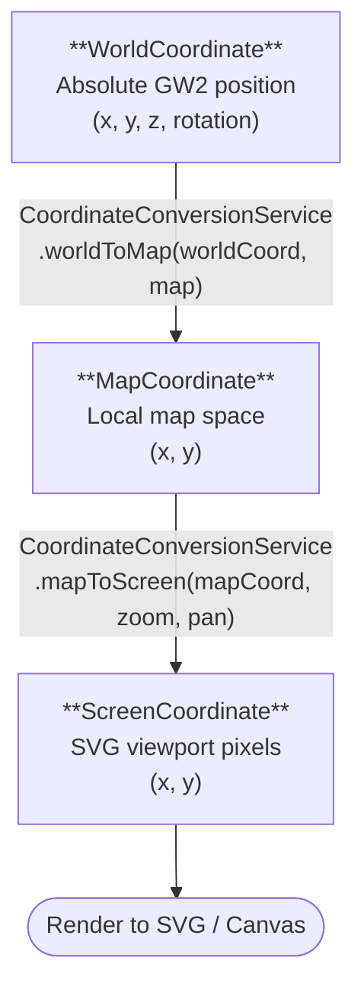
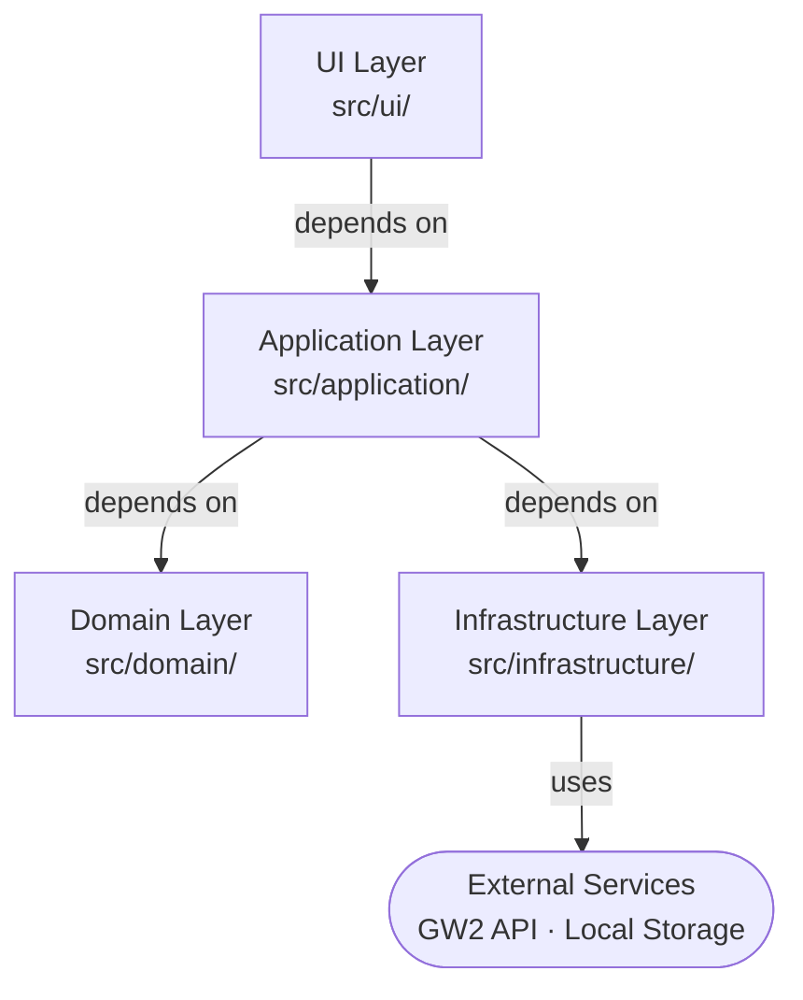

# GW2 Decoration Editor - Architecture

## System Overview

The GW2 Decoration Editor is a web-based application for editing homestead decorations in Guild Wars 2. It's built using a **clean architecture** with clear separation of concerns across multiple layers.



## Layer Responsibilities

### 🎨 UI Layer (`src/ui/`)
- **Responsibility**: Present data to users and capture interactions
- **What belongs here**:
  - Components (MapViewer, LayerPanel, RibbonToolbar, DockManager,
    TabbedContainer, StackedContainer, ContextMenu, ConfirmDialog,
    DecorationListPanel, DividerResizer, DockRegion, DropZoneOverlay,
    PanelDragManager, SelectionRectangle, FileDropZone, ToolPanel)
  - State management stores (AppStore, ZoomStore, SelectionStore,
    LayoutStore, ToolModeStore)
  - DOM manipulation helpers
  - Event binding to commands
  - SVG/Canvas rendering
- **What does NOT belong here**:
  - Business logic
  - API calls
  - Coordinate transformations
  - Data validation beyond UI feedback

### 📦 Application Layer (`src/application/`)
- **Responsibility**: Orchestrate domain operations and coordinate data transfer
- **What belongs here**:
  - Command objects (CreateLayerCommand, MoveDecorationsCommand, etc.)
  - Command handlers (CreateLayerHandler, etc.)
  - Query objects (GetLayersQuery, GetMapQuery, GetLayoutQuery)
  - Query handlers
  - DTOs for data transfer
  - AppService (thin orchestrator)
  - UndoRedoManager and UndoRecord
- **What does NOT belong here**:
  - Business logic (should be in domain)
  - Direct DOM access
  - Repository implementation details

### 🏛️ Domain Layer (`src/domain/`)
- **Responsibility**: Model the problem domain and enforce business rules
- **What belongs here**:
  - Entities (Decoration, Layer, GW2Map)
  - Value Objects (WorldCoordinate, MapCoordinate, ScreenCoordinate)
  - Domain Services (CoordinateConversionService, BoundaryCalculationService)
  - Domain Events (LayerCreatedEvent, DecorationAddedEvent)
  - Business rule validation
  - Pure functions without side effects
- **What does NOT belong here**:
  - HTTP calls
  - DOM manipulation
  - UI frameworks
  - File I/O operations

### 🔌 Infrastructure Layer (`src/infrastructure/`)
- **Responsibility**: Provide technical implementations and external integrations
- **What belongs here**:
  - Repository implementations (LocalLayoutRepository, Gw2MapRepository)
  - Adapters for external services (Gw2ApiAdapter, XmlLayoutAdapter)
  - Cache implementations (LocalStorageCacheAdapter)
  - Low-level HTTP clients (gw2api.js)
  - File I/O operations
- **What does NOT belong here**:
  - Domain logic
  - Business rules
  - UI code

## Key Design Patterns

### 1. **Command Pattern**
Commands represent user intentions to modify the system state.

```javascript
// User wants to create a layer
const command = new CreateLayerCommand(layoutId, 'My New Layer');
appService.executeCommand(command);
```

### 2. **Query Pattern**
Queries represent requests for read-only data without side effects.

```javascript
const query = new GetLayersQuery(layoutId);
const layers = appService.executeQuery(query);
```

### 3. **Repository Pattern**
Repositories abstract data access, allowing different implementations.

```javascript
// Could be LocalLayoutRepository or DatabaseLayoutRepository
const layout = layoutRepository.getById(layoutId);
```

### 4. **Value Object Pattern**
Value Objects are immutable and compared by value, not identity.

```javascript
const coord = new WorldCoordinate(5632, 22048, 0, 0);
// Coordinates with same values are equal
```

### 5. **Domain Event Pattern**
Events capture important business occurrences for auditing and reactions.

```javascript
class LayerCreatedEvent extends DomainEvent {
    constructor(layerId, layoutId, name) {
        super(layoutId);
        this.layerId = layerId;
        this.name = name;
    }
}
```

### 6. **Service Locator / Dependency Injection**
Services are injected or made available through a service locator.

```javascript
const handler = new CreateLayerHandler(eventBus, repository);
```

## Data Flow

### Creating a Layer (Command Flow)



### Loading a Layout (Query Flow)



### Coordinate Transformation



## Dependency Graph



**Key Rule**: Lower layers never depend on higher layers. Inversion of control is used where needed.

## File Organization

```
src/
├── application/
│   ├── AppService.js           # Orchestrator
│   ├── commands/               # Command objects
│   ├── handlers/               # Command & Query handlers
│   ├── queries/                # Query objects
│   └── dtos/                   # Data Transfer Objects
├── config/
│   ├── constants.js            # Magic numbers
│   └── coordinateSystems.js    # Coordinate system docs
├── domain/
│   ├── Decoration.js           # Core entity
│   ├── Layer.js
│   ├── HomesteadLayout.js
│   ├── GW2Map.js
│   ├── SelectionSet.js
│   ├── LayoutConfiguration.js
│   ├── *Coordinate.js          # Value objects
│   ├── ZoomLevel.js
│   ├── LayerId.js
│   ├── MapRect.js
│   ├── MapBoundary.js
│   ├── CoordinateConversionService.js
│   ├── BoundaryCalculationService.js
│   ├── ZoomCalculationService.js
│   ├── LayoutValidationService.js
│   └── events/                 # Domain events
├── infrastructure/
│   ├── adapters/               # External integrations
│   └── repositories/           # Data access
└── ui/
    ├── components/             # UI components
    ├── stores/                 # State management
    ├── domHelpers.js           # DOM utilities
    ├── eventBinders.js         # Event wiring
    ├── EventBus.js             # Pub/sub
    └── renderHelpers.js        # Rendering utilities
```

## State Management

### Global State Stores

1. **AppStore** - Application state
   - currentLayout
   - layers
   - activeLayerId
   - map data

2. **ZoomStore** - Viewport state
   - zoom level
   - pan offset
   - transform matrices
   - zoom history (for undo/redo)

3. **SelectionStore** - User selection state
   - activeLayerId
   - selectedDecorationId

4. **LayoutStore** - Panel layout state
   - dock regions, panel positions, resize state

5. **ToolModeStore** - Active tool mode
   - current tool (select, move, etc.)

### EventBus
Simple pub/sub system for communicating state changes without tight coupling.

## Testing Strategy

### Unit Tests (Domain & Application)
- Pure functions with clear inputs/outputs
- No DOM, no HTTP, no external dependencies
- >70% coverage target

### Integration Tests
- Multiple layers working together
- Real command flows
- Event publishing

### Component Tests
- UI components with mock data
- Event handler behavior
- DOM manipulation

## Performance Considerations

1. **Coordinate System**: Pure functions allow memoization
2. **Rendering**: SVG/Canvas updates only when needed
3. **Caching**: GW2 API responses cached in localStorage
4. **Zoom**: Efficient matrix transformations
5. **Large Layouts**: Virtualization for many decorations

## Extending the System

### Adding a New Feature (e.g., "Duplicate Layer")

1. **Domain Layer**: Create business logic
   ```javascript
   // domain/Decoration.js or similar
   layer.duplicate(); // Add method
   ```

2. **Application Layer**: Create command & handler
   ```javascript
   // application/commands/DuplicateLayerCommand.js
   // application/handlers/DuplicateLayerHandler.js
   ```

3. **UI Layer**: Wire to button click
   ```javascript
   // ui/components/LayerPanel.js
   button.onclick = () => appService.executeCommand(new DuplicateLayerCommand(...))
   ```

4. **Tests**: Add test case
   ```javascript
   // tests/application/DuplicateLayerHandler.test.js
   ```

No changes needed to infrastructure or core domain services!

## Common Gotchas

### ❌ Don't: Put DOM in Domain
```javascript
// BAD - domain should be framework-agnostic
class Layer {
  constructor() {
    document.getElementById('layers').appendChild(this.render());
  }
}
```

### ✅ Do: Keep Domain Pure
```javascript
// GOOD - domain returns data, UI handles rendering
class Layer {
  toDTO() {
    return { id: this.id, name: this.name, ... };
  }
}
```

### ❌ Don't: Skip Validation
```javascript
// BAD - no validation
const layer = new Layer(name);
layout.addLayer(layer); // What if layer is invalid?
```

### ✅ Do: Validate in Domain
```javascript
// GOOD - domain enforces rules
class Layer {
  constructor(id, name) {
    if (!name || name.trim() === '') {
      throw new Error('Layer name required');
    }
    this.name = name;
  }
}
```

### ❌ Don't: Expose Internal State
```javascript
// BAD - external code can modify internals
const layer = layerRepository.getById(id);
layer.decorations.push(new Decoration(...));
```

### ✅ Do: Use Behavior Methods
```javascript
// GOOD - domain enforces rules
const layer = layerRepository.getById(id);
layer.addDecoration(decoration); // Validates and publishes event
```

## Layout System (Panel Docking)

The layout system provides VSCode-style configurable panel docking. Panels (Layers, Decoration List) can be dragged to dock at viewport edges, merged into tabbed groups, or stacked with adjustable dividers. A ribbon toolbar provides grouped commands at the top.

### Binary Split Tree

All panel arrangements are represented as a **binary split tree** (`LayoutConfiguration`):

```
SplitNode (vertical, ratio: 0.8125)
├── PanelNode (map)
└── SplitNode (horizontal, ratio: 0.227)
    ├── PanelNode (layers)
    └── PanelNode (decorationList)
```

Three node types:
- **PanelNode** — Leaf containing a single panel (`{ type: 'panel', panelId }`)
- **TabGroupNode** — Leaf with multiple panels sharing a tab bar (`{ type: 'tabgroup', panels, activeIndex }`)
- **SplitNode** — Branch dividing space between two children (`{ type: 'split', direction, ratio, first, second }`)

Every layout operation (dock, merge, stack, reorder, resize) is an immutable tree transformation.

### Layout Store (Flux Pattern)

`LayoutStore` holds the current `LayoutConfiguration` and follows the Flux pattern:
1. Command is dispatched via `AppService.execute()`
2. Handler produces a new tree via immutable transformations
3. Handler calls `LayoutStore.setState(newLayout)`
4. Store notifies subscribers and auto-persists to localStorage via `LayoutRepository`
5. `DockManager` re-renders the DOM from the new tree

### DockManager Rendering Pipeline

`DockManager` subscribes to `LayoutStore` and recursively renders the tree:

```
LayoutStore.getState().tree
        ↓
DockManager._renderNode(node)
        ↓
  SplitNode  → StackedContainer (flex container + DividerResizer)
  PanelNode  → DockRegion (title bar + content area)
  TabGroupNode → TabbedContainer (tab bar + active panel)
```

Flex ratios on split children match the `SplitNode.ratio` value. `DividerResizer` handles drag-to-resize with ratio clamping.

### Drag-and-Drop Architecture

Drag interactions use native mouse events (not the HTML5 DnD API):

| Component | Responsibility |
|-----------|---------------|
| `PanelDragManager` | Tracks mousedown/move/up, hit-tests viewport edges and panel zones, dispatches commands |
| `DropZoneOverlay` | Renders visual drop zone indicators during drag (edge highlights, panel overlays) |

Drop zone detection:
- **Viewport edge** (60px threshold) → `DockPanelCommand`
- **Panel center** (center 60%) → `MergePanelToTabCommand`
- **Panel edge** (outer 20px) → `StackPanelCommand`
- **Tab bar reorder** → `ReorderPanelCommand`

### Layout Commands and Handlers

| Command | Handler | Effect |
|---------|---------|--------|
| `DockPanelCommand` | `DockPanelHandler` | Moves panel to a viewport edge |
| `MergePanelToTabCommand` | `MergePanelToTabHandler` | Merges panel into a tab group |
| `StackPanelCommand` | `StackPanelHandler` | Stacks panel adjacent to another |
| `ReorderPanelCommand` | `ReorderPanelHandler` | Reorders tabs or stacked panels |
| `ResizeDockCommand` | `ResizeDockHandler` | Updates split ratio on divider drag |
| `ResetLayoutCommand` | `ResetLayoutHandler` | Restores default layout |

### Layout Persistence

`LayoutRepository` serializes the tree to JSON in localStorage under key `gw2-decoration-editor-layout`. On startup, `ApplicationInitializer` loads the saved layout (falling back to default on missing/corrupt data) and publishes a `layout:restored` event.

### Layout Constraints

- Map panel always occupies ≥50% of viewport (`MAP_MIN_RATIO: 0.5`)
- Split ratios clamped to `[0.1, 0.9]`
- Tree depth limited to 10 levels (`MAX_TREE_DEPTH`)
- All four panel IDs must be present and unique in the tree
- TabGroupNode must contain at least 2 panels

### Ribbon Toolbar

`RibbonToolbar` renders a fixed 80px toolbar above the layout tree with grouped commands (File, View, Edit). Buttons dispatch existing application commands. Context-sensitive buttons (e.g., Export) are disabled based on application state.

## Conclusion

This architecture enables:
- ✅ Testing without UI/HTTP complexity
- ✅ Clear separation of concerns
- ✅ Easy to add features
- ✅ Easy to change infrastructure
- ✅ Domain-driven design principles
- ✅ Event sourcing ready
- ✅ Parallel team development
